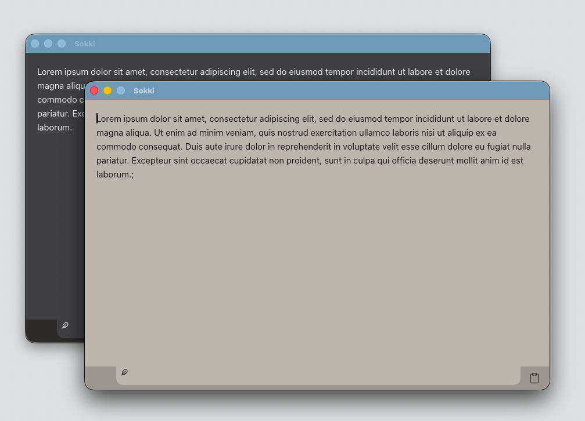

# Sokki

<p align="center">
  
</p>

> Jot your thoughts down.

Sokki is a lightning-fast, minimalist macOS-native memo app built for keyboard-driven workflows. With a single shortcut, it instantly opens a focused text area so you can capture your thoughts without losing momentum.

## Features

**Instantly open, write, and close**

Opens, writes, and closes instantly with a shortcut — letting you capture ideas at the speed they arrive.

**Minimal UI that never breaks your flow**

A single text area, no distractions, and a lightweight macOS-native design.
Sokki stays out of the way so you can stay in your flow.

## Screenshots



## Installation

Download the latest `.dmg` file from the [Releases page](https://github.com/satbunch/sokki/releases) and install it on macOS.

Requirements:
- Node.js >= 18
- Rust (via rustup)
- Tauri CLI (`cargo install tauri-cli`)

## Keyboard Shortcuts

| Shortcut                   | Action                           |
|---------------------------|----------------------------------|
| Cmd + Shift + M           | Show & focus memo window         |
| Esc                       | Hide window                      |
| Cmd + N                   | Open new memo tab                |
| Cmd + W                   | Close current tab                |
| Cmd + C                   | Copy current memo to clipboard   |

## Settings

You can configure the following from the built-in settings window:

- Global shortcut key
- Maximum number of open tabs
- Theme: light / dark / system
- Window opacity

Open Settings via `Cmd + ,` or from the macOS menu bar.

## Data Persistence

All memos and configuration are stored locally and automatically restored when you relaunch the app.

## Contributing

We welcome pull requests and feedback!

### Setup
```bash
git clone https://github.com/satbunch/sokki.git
cd sokki
npm install
npm run tauri dev
```

### Guidelines
- Follow existing code style and conventions
- Submit PRs with clear intent and context
- See [CONTRIBUTING.md](./CONTRIBUTING.md) (coming soon)

## License

This project is licensed under the MIT License. See [LICENSE](./LICENSE.md) for details.

## Maintainer

Sokki is developed and maintained by [@satbunch](https://github.com/satbunch).

## Security

If you discover a vulnerability, please report it privately via GitHub issues or contact the maintainer directly.

## Version

Current release: **v0.1.0**

Changelog and tagging will begin in future minor versions.
